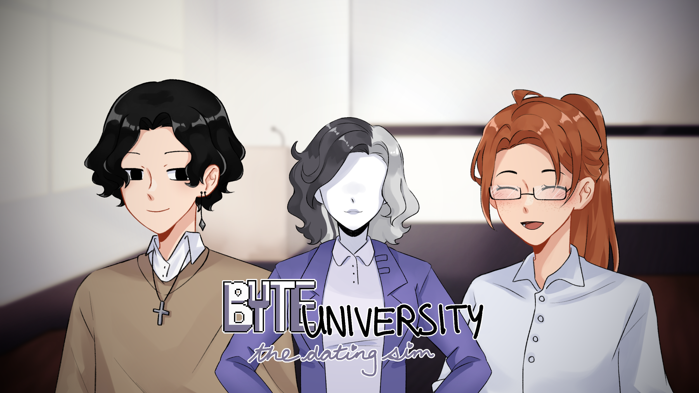

 ---

## Welcome to Byte University!
> Interact with two characters, Elliot and Taylor in this short bite sized game! 

 
Byte University: The Dating Sim was created as our first ever Hackathon project. We brainstormed this project before the hackathon and despite having little to no experience in web design or in creating this type of game, we found the idea of creating this game captivating and we knew that this was what we wanted to do.
  
Due to our lack of background, this project was definitely difficult to start. There were many things that we didn't know when we first began but we're confident enough to say that we learnt a lot throughout the time we had for the hackathon. It was a great experience for us and we had a lot of fun.  
 

## Link: to the game: <a href="https://pixlepixle.github.io/Byte-University-The-Dating-Sim/">https://pixlepixle.github.io/Byte-University-The-Dating-Sim/</a>

 
 

### Credits:
- Peter (@PixlePixle): Code
- Kaytie (@lin-kaytie): Artwork
- Azeez (@sentientrock): Script/Code
- Andy: Script
